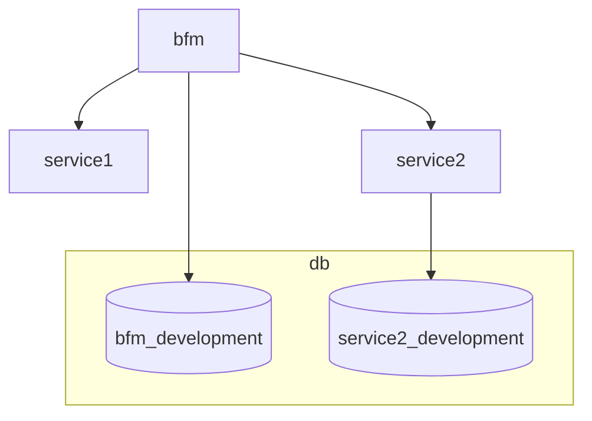
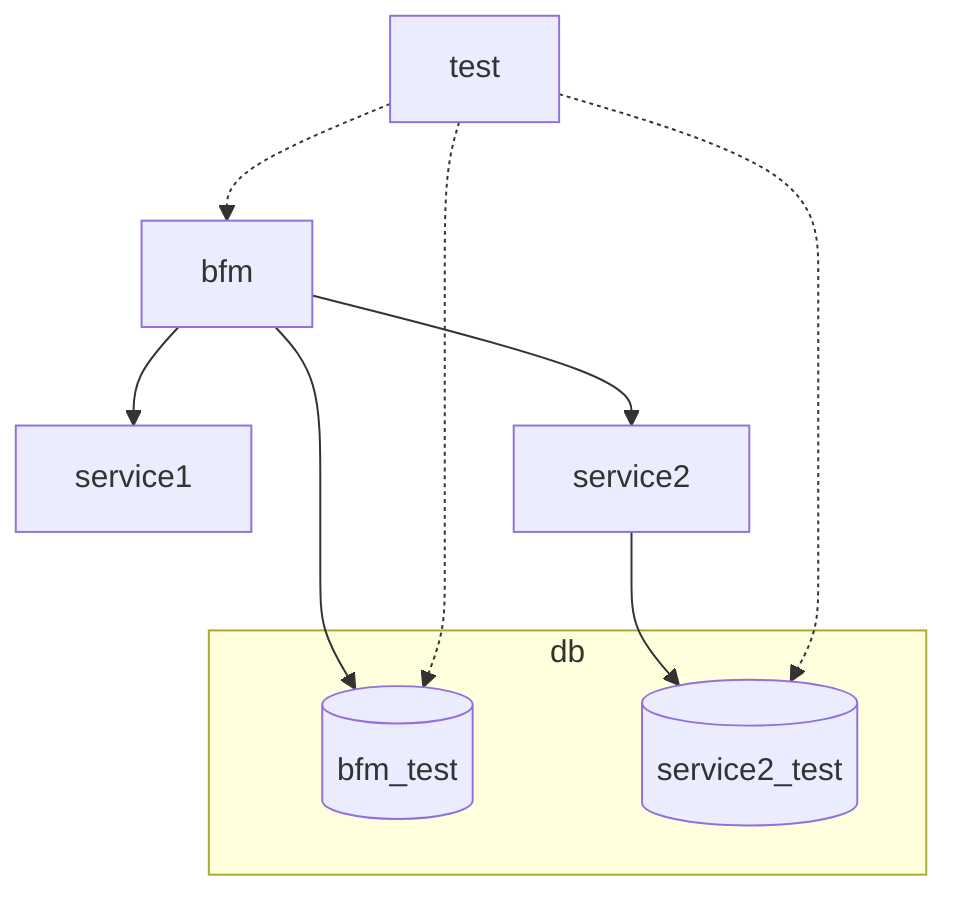

## Installation
1. Clone the repo
   ```bash
   git clone https://github.com/bozydar/bfm-dev-env.git
   ```
2. Setup the environment
   ```bash
   make setup
   ```
3. Run the environment
   ```bash
   make up
   ```
4. Open http://localhost:8000/

## Additional commands

### Stop the environment
```bash
make down
```

### Rebuild DB
```bash
make db-recreate
```

### Run integration tests
```bash
make test
```

## Solution description

Main idea behind my solution is to keep DB, Integration tests, and working code in the separate containers. Moreover all the stack can be run in two environments: `development` and `test`. The `development` environment is used for local development and the `test` environment is used for local integration tests and CI.

### DB

DB is a separate container. It is a Postgres database. The DB is managed by Docker. It contains `sql` directory containing files used to initialize DBs inside the Postgres server. E.g. `bfm_init.sql` looks like this:

```sql
\c postgres

create database bfm_development;
\c bfm_development
\ir ./include/bfm_schema.sql
\ir ./include/bfm_seed.sql

create database bfm_test;
\c bfm_test
\ir ./include/bfm_schema.sql
```
It creates two databases `bfm_development` and `bfm_test`. I've separated both databases because the first one is relatively persistent and used during the development process and the second one is purged during the integration tests.
`include` directory contains sqls which create the schema for both databases and seed the development database.

The db scripts are executed when the container is run but only if the `local/db` directory is empty. This directory is mapped to the database data directory inside the container. 

If you need to add another DB you can add another SQL script and follow the existing pattern.

### Test

Test container includes RSpec scripts which operates on other containers. It allows them to seed the data, call the BFM, and check the expected response. There is no problem to connect the test container to the other service containers if needed.
This container is defined in the `docker-compose.test.yml` file. 

### BFM

This container represents the monolith. It depends on the other components (except the `test` environment where Test depends on it). It is a Rails application.

### Service1 and Service2

They represent the microservices. Service2 can call their own DB.

### Development environment

In this environment developers can modify the code on their local disks. The containers don't need to be rebuilt because the volumes are mapped.

**Dependency diagram loosely representing the `docker-compose.yml` file.**



### Test environment

This environment is designed for integration tests. It includes additional container mapped to the `./test` directory.
This environment is used by CI as well. 

**Dependency diagram loosely representing the `docker-compose.test.yml` file.**


# Answers to questions

## Problem framing

### What are the main pain points?
* Run on the most popular OSes
* Fast
* Intuitive to use
  * Minimal documentation
  * Predictable UX
* Intuitive to change
  * Minimal documentation
  * Predictable behavior
  * Self describing
  * Using only well-known tools
* Use cases should be separated
  * No state leaking
  * Prevention of internal dependencies
* The solution should be transparent when users are focused on coding
* It should work the same way in the CI as it works on their local.

### Who are the users, and what are their needs?
* The users are developers.
* They want
  * The solution to work as they expect
  * Be able to understand it and debug quickly.
  * Not to learn another tool

## Proposed solution

### Tools or approaches you’d introduce or build
I used following tools to solve the problem:
* Monorepo
* Docker; `docker-compose`;
* Makefile
* Github Actions

### Tradeoffs and reasoning
* Monorepo
  * **Tradeoff**: Everything in one place what can be problematic for large projects
  * **Reasoning**: It is much easier to manage all the stuff in one place.
* Using Docker
  * **Tradeoff**: Can't run applications/libraries from Windows
  * **Reasoning**: The alternative is to use Vagrant but I assume we won't mix Unix and non-unix systems.
* Using Makefile
  * **Tradeoff**: It is not always perfect because the tool is rather for compilation, linking and resource management.
  * **Reasoning**: On the other hand basic syntax is understndable for nearly all developers.
  * **Tradeoff**: It is not that easy for advanced workflow because the syntax can become unreadable
  * **Reasoning**: For the current complication is good enough. If it becomes more complex, then it can be rewritten using Python or Ruby.
* Using Github Actions
  * **Tradeoff**: We'll pay Microsoft which is reach enough
  * **Reasoning**: It is free for small usage.
* DB project keeps all the SQL scripts in one directory.
  * **Tradeoff**: My gut feeling is that the DB scripts should be kept separately in the services because otherwise it suggests that we can use a common database for services what is a bad practice
  * **Reasoning**: DB management should be handled by a separate tool like ActiveMigration or Entity Framework and the way how it will be managed deeply depends on the selected tool.
* DB data is kept in `local/db` directory
  * **Tradeoff**: Somebody may push it to the repo by chance
  * **Reasoning**: It is not a big deal moreover one can easy switch change the data without running any dump or restore

## Measurement & Impact

### How would you measure success?
* Time between starting onboarding and seeing the "screen of success"

### How would you gather feedback?
* Jira tickets created for the solution
* Poll
* Competition for the best idea for a new feature with a prize