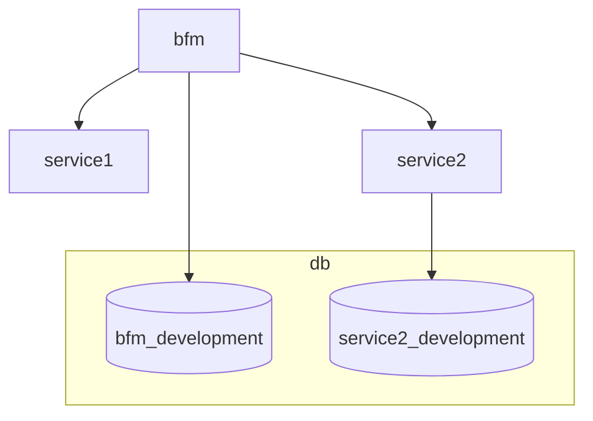
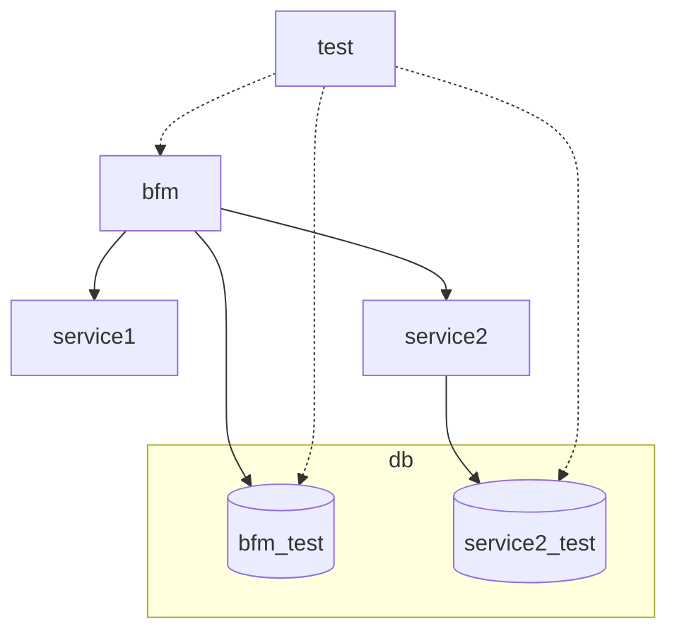

## Installation
1. Clone the repo
   ```bash
   git clone https://github.com/bozydar/bfm-dev-env.git
   ```
2. Setup the environments
   ```bash
   make setup
   ```
3. Run the stack in development mode
   ```bash
   make up
   ```
4. Open http://localhost:8000/

## Additional commands

### Stop the stack
```bash
make down
```

### Rebuild DB
```bash
make db-recreate
```

### Run integration tests
```bash
make test
```

## Solution description

The main idea behind my solution is to keep DB, Integration tests, and working code in separate containers. Moreover, all the stack can be run in two environments: `development` and `test`. The `development` environment is used for local development and the `test` environment is used for running integration tests on local and on a CI/CD server.

### DB

DB is a separate container. It is a Postgres database server. It contains `sql` directory with files used to initialize DBs inside the Postgres server. E.g. `bfm_init.sql` looks like this:

```sql
\c postgres

create database bfm_development;
\c bfm_development
\ir ./include/bfm_schema.sql
\ir ./include/bfm_seed.sql

create database bfm_test;
\c bfm_test
\ir ./include/bfm_schema.sql
```
It creates two databases `bfm_development` and `bfm_test`. I've separated both databases because the first one is relatively persistent and used during the development process, and the second one is purged during the integration tests.
`include` directory contains SQL files which create the schema for both databases and a seed for the development database.

The db scripts are executed when the container is run but only if the `local/db` directory is empty. This directory is mapped to the database data directory inside the container. 

If you need to add another DB you can add another SQL script and follow the existing pattern.

### Test

Test container includes RSpec scripts that talk to other containers. It seeds the test DB with fixtures, calls the BFM, and checks the expected responses. There is no problem with connecting the test container to the other service containers if needed.
This container is defined in the `docker-compose.test.yml` file. It doesn't exist in the `docker-compose.yml` file though.

### BFM

This container represents the monolith. It depends on the other containers (except the `test` environment). It is a Rails application.

### Service1 and Service2

They represent the microservices. Service2 can call their own DB to prove that its DB is isolated from the BFM.

### Development environment

In this environment developers can modify the code on their local disks. The containers don't need to be rebuilt because the volumes are mapped to working directories.

**Dependency diagram loosely representing the `docker-compose.yml` file.**



### Test environment

This environment is designed for integration tests. This environment is used by CI as well. 

**Dependency diagram loosely representing the `docker-compose.test.yml` file.**


# Answers to questions

## Problem framing

### What are the main pain points?
* Run on the most popular OSes
* Fast
* Intuitive to use
  * Minimal documentation
  * Predictable UX
* Intuitive to change
  * Minimal documentation
  * Predictable behavior
  * Self describing
  * Using only well-known tools
* Use cases should be separated
  * No state leaking
  * Prevention of internal dependencies
* The solution should be transparent when users are focused on coding
* It should work the same way in the CI as it works on local.

### Who are the users, and what are their needs?
* The users are developers.
* They want
  * To work as they expect (intuitive UX)
  * Be able to understand it and debug quickly.
  * Not to learn another tool
  * No sophisticated configuration or abstract layer

## Proposed solution

### Tools or approaches you’d introduce or build
I've used the following tools and approaches to implement the solution:
* Monorepo
* Docker; `docker-compose`;
* Makefile
* Github Actions

### Tradeoffs and reasoning
* Monorepo
  * **Tradeoff**: 
    * Everything in one place what can be problematic for large projects
    * Lower barrier to modify the things which shouldn't be touched
  * **Reasoning**: 
    * It is much easier to manage all the stuff in one place.
    * Versioning is straight forward
* Using Docker
  * **Tradeoff**: Can't run applications/libraries from Windows
  * **Reasoning**: The alternative is to use Vagrant, but I've assumed we won't mix Unix and non-Unix systems.
* Using Makefile
  * **Tradeoff**: It is not always perfect because the tool is designed rather for compilation, linking and resource management.
  * **Reasoning**: On the other hand, basic syntax is understandable for nearly all developers.
  * **Tradeoff**: It is not that easy for advanced workflows because the syntax can become unreadable pretty quickly
  * **Reasoning**: For the current state is good enough. If it becomes more complex, it can be replaced with Python or Ruby.
* Using GitHub Actions
  * **Tradeoff**: We'll pay Microsoft, which is reach enough
  * **Reasoning**: 
    * It is free for small usage.
    * The most popular CI/CD tool.
* DB project keeps all the SQL scripts in one directory.
  * **Tradeoff**: My gut feeling is that the DB scripts should be kept separately in the services because otherwise it suggests that we can share data between microservices via DB, which is a bad practice.
  * **Reasoning**: DB versioning should be handled by a separate tool like ActiveMigration or Entity Framework, and the implementation may strongly depend on it.

## Measurement & Impact

### How would you measure success?
* Time between starting onboarding and seeing the "screen of success"

### How would you gather feedback?
* Jira tickets created for the solution.
* Polls every 3 months.
* Competition for the best idea for a new feature with a prize.

# Ways to improve
* Templates for the microservices
  * It modifies the `docker-compose*.yml` files.
  * Adds the DB definitions
  * Generates test scaffold
* Choosing the DB versioning system
* Moving from Makefile to a legit CLI application
* Automatic deployment to the staging servers
* DB dump/restore commands for easier debugging staging or prod issues